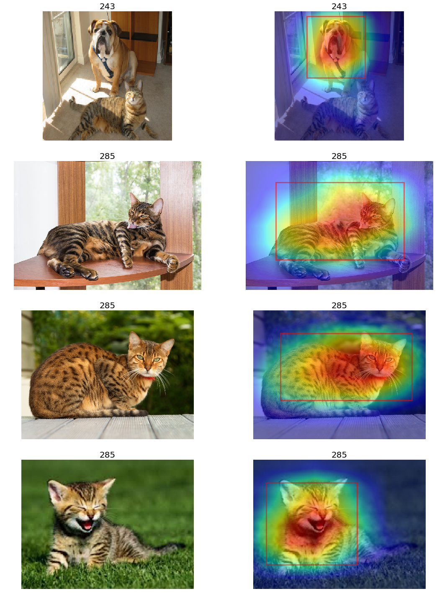

# Grad-CAM in PyTorch

This is a Grad-CAM implementation in Pytorch inspired by @kazuto1011's work (https://github.com/kazuto1011/grad-cam-pytorch).

I modified his code in order to deal with following needs
- to process multiple images based on their own class labels
- initialize gradcam with target layer to avoid out-of-memory error
- add bounding boxes using skimage

## Dependencies
- python 3.6
- pytorch 0.4.0
- torchvision 0.2.1
- skimage 0.14.0

## Example (resnet152, 'layer4.2')

